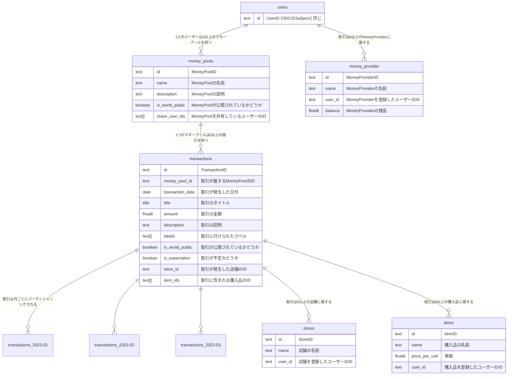

```mermaid
erDiagram
  users ||--o{ money_pools : "1人のユーザーは0以上のマネープールを持つ"
  money_pools ||--o{ transactions : "1つのマネープールは0以上の取引を持つ"
  transactions ||--o{ transactions_2023-01 : "取引は月ごとにパーティショニングされる"
  transactions ||--o{ transactions_2023-02 : ""
  transactions ||--o{ transactions_2023-03 : ""
  transactions ||--o{ stores : "取引は0以上の店舗に属する"
  transactions ||--o{ items : "取引は0以上の購入品に属する"
  users ||--o{ money_provider : "取引は0以上のMoneyProviderに属する"

  users {
    text id "UserID OIDCのSubjectと同じ"
  }

  money_pools {
    text id "MoneyPoolID"
    text name "MoneyPoolの名前"
    text description "MoneyPoolの説明"
    boolean is_world_public "MoneyPoolが公開されているかどうか"
    text[] share_user_ids "MoneyPoolを共有しているユーザーのID"
  }

  transactions {
    text id "TransactionID"
    text money_pool_id "取引が属するMoneyPoolのID"
    date transaction_date "取引が発生した日付"
    title title "取引のタイトル"
    float8 amount "取引の金額"
    text description "取引の説明"
    text[] labels "取引に付けられたラベル"
    boolean is_world_public "取引が公開されているかどうか"
    boolean is_expectation "取引が予定かどうか"
    text store_id "取引が発生した店舗のID"
    text[] item_ids "取引に含まれる購入品のID"
  }

  transactions_2023-01 {
  }

  transactions_2023-02 {
  }

  transactions_2023-03 {
  }

  stores {
    text id "StoreID"
    text name "店舗の名前"
    text user_id "店舗を登録したユーザーのID"
  }

  items {
    text id "ItemID"
    text name "購入品の名前"
    float8 price_per_unit "単価"
    text user_id "購入品を登録したユーザーのID"
  }

  money_provider {
    text id "MoneyProviderID"
    text name "MoneyProviderの名前"
    text user_id "MoneyProviderを登録したユーザーのID"
    float8 balance "MoneyProviderの残高"
  }
```
