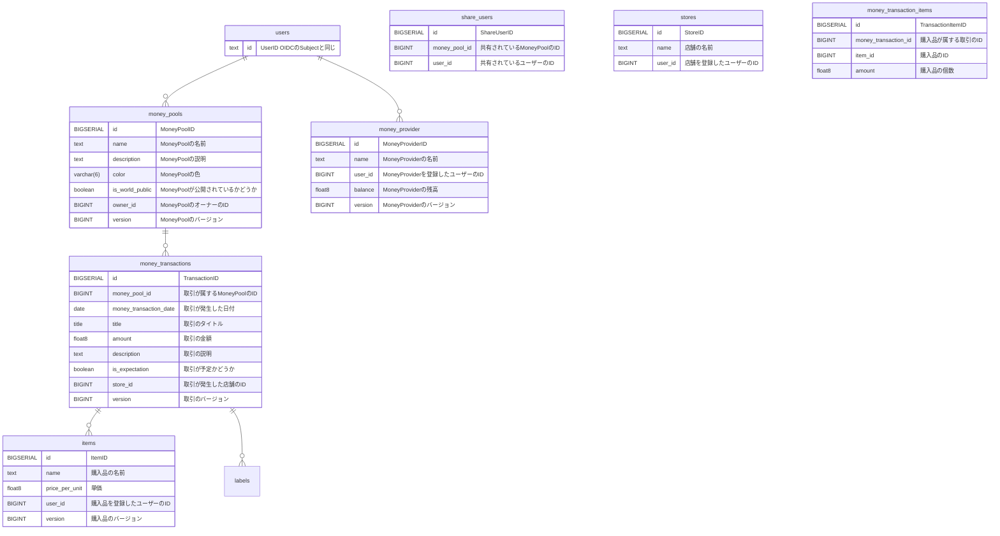

```mermaid
erDiagram
  users ||--o{ money_pools : ""
  money_pools ||--o{ money_transactions : ""
  money_transactions ||--o{ items : ""
  money_transactions ||--o{labels: ""
  users ||--o{ money_provider : ""

  users {
    text id "UserID OIDCのSubjectと同じ"
  }

  money_pools {
    BIGSERIAL id "MoneyPoolID"
    text name "MoneyPoolの名前"
    text description "MoneyPoolの説明"
    varchar(6) color "MoneyPoolの色"
    boolean is_world_public "MoneyPoolが公開されているかどうか"
    BIGINT owner_id "MoneyPoolのオーナーのID"
    BIGINT version "MoneyPoolのバージョン"
  }

  share_users {
    BIGSERIAL id "ShareUserID"
    BIGINT money_pool_id "共有されているMoneyPoolのID"
    BIGINT user_id "共有されているユーザーのID"
  }

  money_transactions {
    BIGSERIAL id "TransactionID"
    BIGINT money_pool_id "取引が属するMoneyPoolのID"
    date money_transaction_date "取引が発生した日付"
    title title "取引のタイトル"
    float8 amount "取引の金額"
    text description "取引の説明"
    boolean is_expectation "取引が予定かどうか"
    BIGINT store_id "取引が発生した店舗のID"
    BIGINT version "取引のバージョン"
  }

  stores {
    BIGSERIAL id "StoreID"
    text name "店舗の名前"
    BIGINT user_id "店舗を登録したユーザーのID"
  }

  items {
    BIGSERIAL id "ItemID"
    text name "購入品の名前"
    float8 price_per_unit "単価"
    BIGINT user_id "購入品を登録したユーザーのID"
    BIGINT version "購入品のバージョン"
  }

  money_transaction_items {
    BIGSERIAL id "TransactionItemID"
    BIGINT money_transaction_id "購入品が属する取引のID"
    BIGINT item_id "購入品のID"
    float8 amount "購入品の個数"
  }

  money_provider {
    BIGSERIAL id "MoneyProviderID"
    text name "MoneyProviderの名前"
    BIGINT user_id "MoneyProviderを登録したユーザーのID"
    float8 balance "MoneyProviderの残高"
    BIGINT version "MoneyProviderのバージョン"
  }
```
